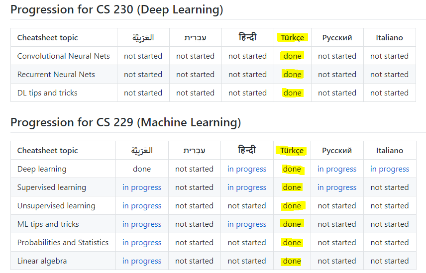
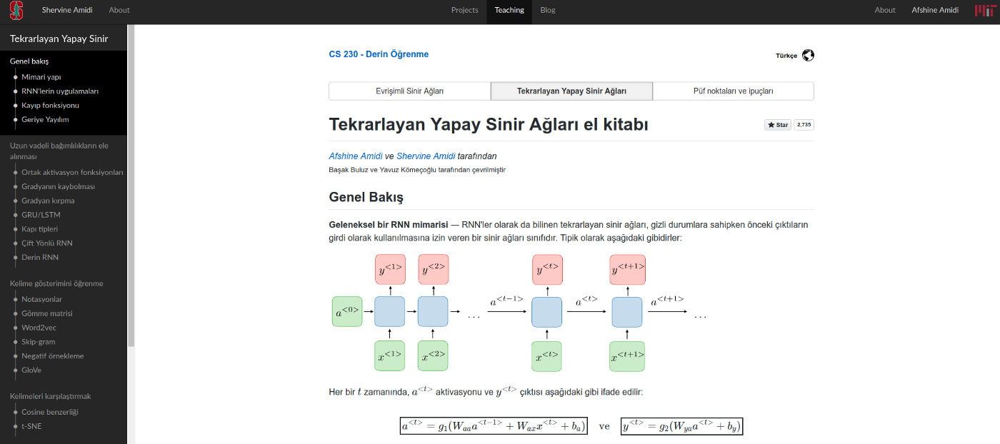

# Stanford CS 229 — Makine Öğrenmesi ve CS 230 — Derin Öğrenme El Kitapları Artık Türkçe

En kaliteli ve öğrenmeyi hızlandıracak Stanford CS 229 — Machine Learning ve CS
230 — Deep Learning ders içeriklerinden oluşturulmuş harika el kitaplarını
[Başak Buluz](https://www.linkedin.com/in/basak-buluz-62800088/) ve [M.Ayyüce
Kızrak](https://www.linkedin.com/in/merve-ayyuce-kizrak/) ile birlikte Türkçe’ye
çevirdik.  Bugün itibariyle de web sitesinde yayınlandı.

Aşağıdaki linklerden tüm el kitaplarına Türkçe olarak ulaşabilirsiniz.

**CS 229:**

* [Gözetimli Öğrenme El
Kitabı](https://stanford.edu/~shervine/l/tr/teaching/cs-229/cheatsheet-supervised-learning)
* [Gözetimsiz Öğrenme El
Kitabı](https://stanford.edu/~shervine/l/tr/teaching/cs-229/cheatsheet-unsupervised-learning)
* [Derin Öğrenme El
Kitabı](https://stanford.edu/~shervine/l/tr/teaching/cs-229/cheatsheet-deep-learning)
* [Makine Öğrenmesi İpuçları ve Püf Noktaları El
Kitabı](https://stanford.edu/~shervine/l/tr/teaching/cs-229/cheatsheet-machine-learning-tips-and-tricks)

**CS 230:**

* [Evrişimli Sinir Ağları El
Kitabı](https://stanford.edu/~shervine/l/tr/teaching/cs-230/cheatsheet-convolutional-neural-networks)
* [Tekrarlayan Yapay Sinir Ağları El
Kitabı](https://stanford.edu/~shervine/l/tr/teaching/cs-230/cheatsheet-recurrent-neural-networks)
* [Derin Öğrenme Püf Noktaları ve İpuçları El
Kitabı](https://stanford.edu/~shervine/l/tr/teaching/cs-230/cheatsheet-deep-learning-tips-and-tricks)

> “Çalışmak demek, boşuna yorulmak, terlemek değildir.  Zamanın gereklerine
> göre bilim ve teknik ve her türlü uygar buluşlardan azami derecede istifade
etmek zorunludur.” Mustafa Kemal Atatürk

### [Yavuz Kömeçoğlu](https://medium.com/@komecoglu.yavuz)

🇹🇷 Machine Learning R&D Engineer
[@KodiksBilisim](http://twitter.com/KodiksBilisim) | Deep Learning Enthusiast |
[http://yavuzkomecoglu.com/](http://yavuzkomecoglu.com/)

